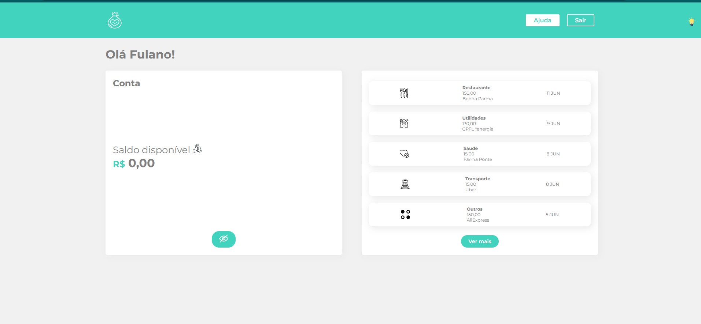
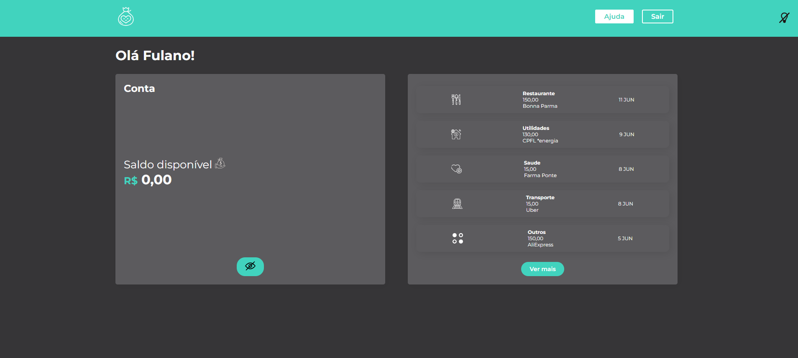

# Foto do Projeto
    Tema claro
 

    Tema escuro
 

# Obs :

  <h2>Usando o styled-components</h2>

Lembre-se de declarar seus componentes e styled components fora dos métodos de renderização do React.

Compor elementos estilizados para criar novas telas

Implementar o tema escuro --ThemeProvider

    import { ThemeProvider } from "styled-components";
    import { temaEscuro, temaClaro } from "./Components/UI/temas";
    import { BtnTema } from "./Components/UI";
    import SwitcherTema from "./Components/SwitcherTema";

E dano sua responsabilida pro arquivo transformando em obj 

temas.js

        export const temaClaro ={
            body:fundoClaro,
            inside:conteudoClaro,
            text: textoFundoClaro,
        };

        export const temaEscuro ={
            body: fundoEscuro,
            inside:conteudoEscuro,
            text: textoFundoEscuro,
        }
App.js

        <ThemeProvider theme={tema ? temaClaro : temaEscuro}>

Styled-Component Container-index.js

         background-color: ${({theme})=> theme.body};

alterar cores de icones SVG usando filter

    filter : "invert(100%)",
# Dependecias 

    npm install --save styled-components 
    npm 
    import styled from 'styled-components'
    
 <h4> stylizando o componete </h4>

    <Titulo>Children</Titulo>

const Titulo = styled.h1`
    color: grey;
    padding: 25px 0;
    `;

 <h4> stylizando global</h4>

 crinado uma pasta Components/GlobalStyle.js

    import {createGlobalStyle} from 'styled-components'

    export const GlobalStyle = createGlobalStyle`
    *{
    box-sizing: border-box;
    font-family: "Montserrat", sans-serif;
    margin: 0;
    padding: 0;
    text-decoration: none;
    color: grey;
    }
    `;

    USAR EM :

    EM APP.JS

    import {GlobalStyle} from "./Components/GlobalStyle";
    
    <GlobalStyle/>

<h3>variaveis</h3> 

Cria pasta UI /variaveis
export const cor = #
export const cor = #

---usar

const StylerHeader = styled.nav`

  background-color: ${corPrimaria};
criar a componete estilo com variaveis

img className="imagem-logo"  = Logo - componet

const Logo = styled.img`
  height: 50px;
  width: 50px;
`;

    <Logo src=''/>
----props

Pequenas mudança em um mesmo componente

        background: ${(props)=> props.$primary? "white" : corPrimaria};
        color: ${(props)=> props.$primary? corPrimaria : "white"}

        <BotaoGeral $primary href="https://google.com">
          Ajuda
        </BotaoGeral>

UI/index.js

UI - COMPONENTES DE ESTILOS REUTILIZAVEL

    import styled from 'styled-components'

    export const Incone = styled.img`
            height: 25px;
            width: 25px;
            @media (max-width: 800px) {
                width: 95%;
                margin: 5px;
            }
    `

como usar :

    import {Incone} from  '../../Components/UI'

<h4> QUANDO O INCONE IMPORTADO MUDA<h4>

    const  InconeMargin = styled(Incone)`
    marginTop: "2px"
    `;

<h3>Obj</h3>

Criar estilo dentro do js  como componete

Criando novos Componentes Funcionais e adicionando
o Styled Components a eles

<h3>ImagFilter</h3>

Coleçao de incones em um so luvar determinado pelo obj 
ImagenssFilter import

<h2>Fonte</h2>

Em index.html

ex:
       
        <link rel="stylesheet" href="https://fonts.googleapis.com/css2?family=Montserrat:wght@300;400;600;700&display=swap"/>